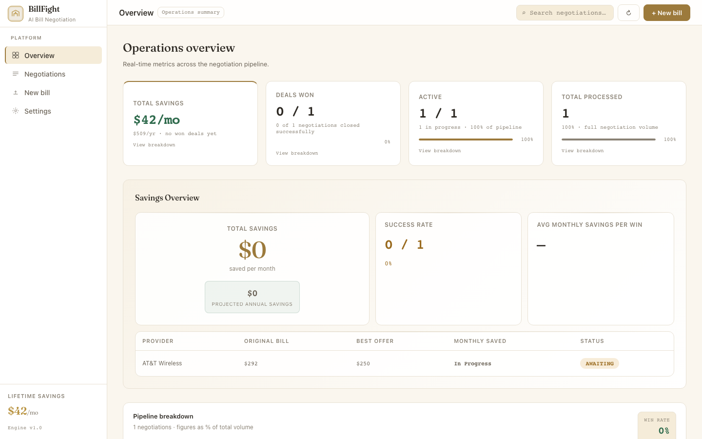
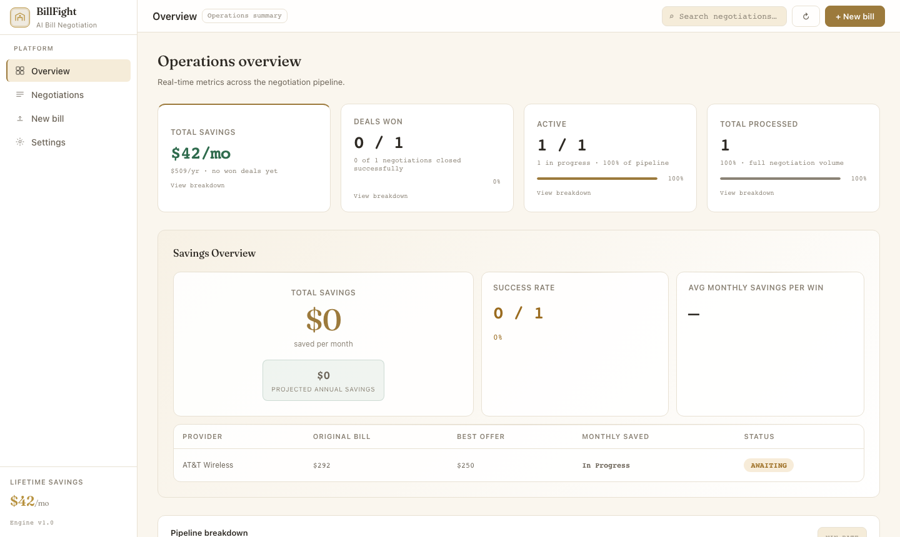
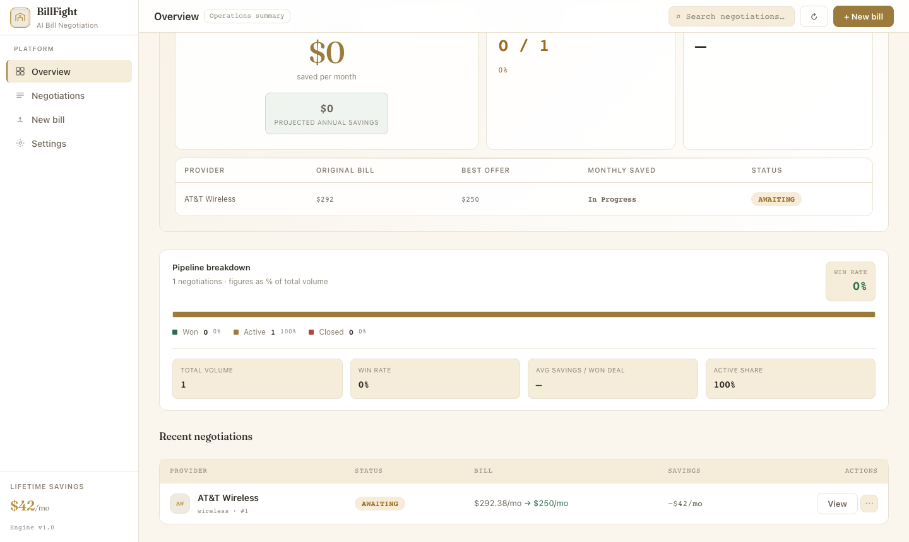

# RatePilot — Autonomous Bill Negotiation Agent

> An AI agent that autonomously negotiates recurring bills — researches competitor pricing, builds a data-driven strategy, drafts personalized negotiation emails, and adapts based on provider responses across multiple rounds.

**Live demo:** [ratepilott.netlify.app](https://ratepilott.netlify.app) · **Repo:** [sssahoo-lang/ratepilot-agent](https://github.com/sssahoo-lang/ratepilot-agent)

---

## What It Does

Most people overpay on recurring bills because negotiating is time-consuming and awkward. RatePilot removes the human from the loop entirely.

Upload a bill (PDF, photo, or text), and the agent independently researches the market, identifies leverage points, and writes a ready-to-send negotiation email grounded in real competitor data. When the provider replies, paste their response and the agent decides whether to accept, counter, or escalate — preserving full context across every round.

---

## Screenshots

### Operations Dashboard

*Real-time pipeline metrics: savings tracking, win rate, deal volume, and per-provider breakdown.*

### Autonomous Negotiation Pipeline

*The agent runs three sequential Claude calls — market research, strategy, and email draft — each logged with reasoning and timestamps.*

### Email Drafted and Sent via Gmail API

*The drafted email is pre-populated in Gmail with the correct provider address and account number — ready to send in one click.*

### Multi-Round Outcome

*After two rounds: AT&T moved from $292/mo to $250/mo — a 14% reduction and $504/year in savings.*

---

## How the Agent Works

The pipeline runs autonomously in eight stages:

| Stage | What happens |
|---|---|
| Upload | Bill received as PDF, TXT, or photo (JPG/PNG/WEBP/GIF) |
| Parse | Regex extracts provider/amount; Claude vision handles photos |
| Research | Agent finds competitor pricing, tailored to account type (individual vs. family multi-line) |
| Strategy | Builds opening position, target price, walkaway threshold, and key arguments |
| Draft | Writes a personalized negotiation email grounded in real account data |
| Send | Email delivered to the provider via Gmail API (optional) |
| Classify | Agent reads the provider reply and decides: accept / counter / escalate |
| Track | Outcome logged; savings dashboard updated with monthly and annual projections |

---

## Engineering Highlights

**Async pipeline without blocking the event loop**
All Claude API calls are synchronous (Anthropic SDK). Running them directly inside `async def` handlers blocked FastAPI's single asyncio event loop, freezing concurrent requests and making the UI appear unresponsive. Fixed by wrapping every blocking call with `asyncio.to_thread()`, moving them off the event loop into a thread-pool executor.

**Multi-turn negotiation with full context**
Counter-offers aren't fresh prompts — each round passes the original bill data, the competitor research, the established strategy, and the provider's reply to Claude. This lets the agent hold a consistent position across rounds rather than drifting.

**Smart bill parsing with fallback chain**
PDF/TXT bills first go through a fast regex extractor (provider name, total due, account number, line count). Only if that fails does the pipeline escalate to a Claude call — minimizing API usage for well-structured bills. Photos always route through Claude vision.

**Multi-line family plan awareness**
The agent detects the number of lines on a wireless bill and explicitly compares against family plan pricing only — not single-line rates. "Switching 9 lines is disruptive" is used as leverage in the email.

**Production deployment on Railway**
Railway assigns a dynamic `$PORT` at runtime. The app was initially hardcoded to port 8000, causing 502 errors despite successful builds. Fixed `main.py` to read `os.environ.get("PORT", 8000)` and disabled `reload=True` in production.

---

## Tech Stack

| Layer | Technology |
|---|---|
| Frontend | React 18, Vite, vanilla CSS (custom design system) |
| Backend | Python 3.11, FastAPI, SQLite via aiosqlite |
| AI | Anthropic Claude API (`claude-sonnet-4-5`) — multi-stage agentic pipeline |
| Email | Gmail API via OAuth 2.0 |
| Export | jsPDF — client-side PDF generation |
| Deploy | Railway (backend), Netlify (frontend) |

---

## Project Structure

```
ratepilot-agent/
├── main.py                  # FastAPI entrypoint — binds to $PORT for Railway
├── agent_service.py         # Claude API calls — research, strategy, email, classify
├── database.py              # SQLite schema and async migrations
├── gmail_service.py         # Gmail OAuth send/reply helpers
├── provider_emails.py       # Provider retention email address lookup
├── requirements.txt
├── routers/
│   ├── agent.py             # Pipeline orchestration — /api/agent/*
│   ├── bills.py             # Bill upload and parsing — /api/bills/*
│   ├── negotiations.py      # Negotiation CRUD — /api/negotiations/*
│   └── email_router.py      # Email send/check — /api/email/*
└── frontend/
    ├── src/
    │   ├── App.jsx           # All views and state (upload → pipeline → detail → outcome)
    │   ├── index.css         # Design system — CSS custom properties, light/dark themes
    │   ├── constants.js      # API base URL, status config, step labels
    │   └── utils/savings.js  # Savings computation helpers
    ├── .env.development      # VITE_API_URL → localhost:8000
    └── .env.production       # VITE_API_URL → Railway backend
```

---

## Quick Start

### Backend

```bash
git clone https://github.com/sssahoo-lang/ratepilot-agent.git
cd ratepilot-agent
pip install -r requirements.txt

export ANTHROPIC_API_KEY=your_key_here
uvicorn main:app --reload
```

### Frontend

```bash
cd frontend
npm install
npm run dev
# App at http://localhost:5173 · API at http://localhost:8000
```

Gmail sending is optional — without OAuth credentials the app runs fully and negotiation emails are shown for manual copying.

---

## API Reference

| Method | Endpoint | Description |
|---|---|---|
| `POST` | `/api/bills/upload` | Upload bill (PDF, TXT, JPG, PNG, WEBP, GIF) |
| `GET` | `/api/bills/{id}` | Get parsed bill data |
| `POST` | `/api/agent/start` | Start negotiation pipeline |
| `POST` | `/api/agent/simulate-reply` | Submit provider reply for classification |
| `POST` | `/api/agent/retry` | Retry a failed negotiation |
| `GET` | `/api/negotiations/` | List all negotiations |
| `GET` | `/api/negotiations/{id}` | Get negotiation with full step history |
| `DELETE` | `/api/negotiations/{id}` | Delete a negotiation |
| `POST` | `/api/email/send` | Send negotiation email via Gmail |
| `POST` | `/api/email/check-reply` | Poll Gmail for provider reply |

---

## Environment Variables

| Variable | Required | Description |
|---|---|---|
| `ANTHROPIC_API_KEY` | Yes | Claude API key |
| `SEED_DEMO_DATA` | No | Set `true` to seed sample negotiations on startup |

Gmail OAuth credentials (`credentials.json` + `gmail_token.json`) are optional — see [Gmail OAuth setup](https://developers.google.com/gmail/api/quickstart/python).

---

## Known Limitations

- **Gmail OAuth requires local setup** — the interactive browser flow doesn't work in a server environment without additional configuration
- **SQLite resets on Railway redeploy** — without a persistent volume, negotiation history is cleared on each deployment
- **No authentication** — designed as a single-user tool; all negotiations are visible to anyone with the URL
- **Rate limits** — Anthropic free tier (10K tokens/min) may slow the pipeline on large multi-page bills

---

## Roadmap

- [ ] PostgreSQL for persistent production storage
- [ ] JWT authentication and multi-user support
- [ ] Live web search for real-time competitor pricing
- [ ] Celery + Redis for async task queue
- [ ] Auto-detect replies via Gmail polling

---

## Author

**Sriya Smita Sahoo** — MS Computer Science, Indiana University Bloomington

[linkedin.com/in/sriya-smita-sahoo](https://linkedin.com/in/sriya-smita-sahoo) · [github.com/sssahoo-lang](https://github.com/sssahoo-lang)
